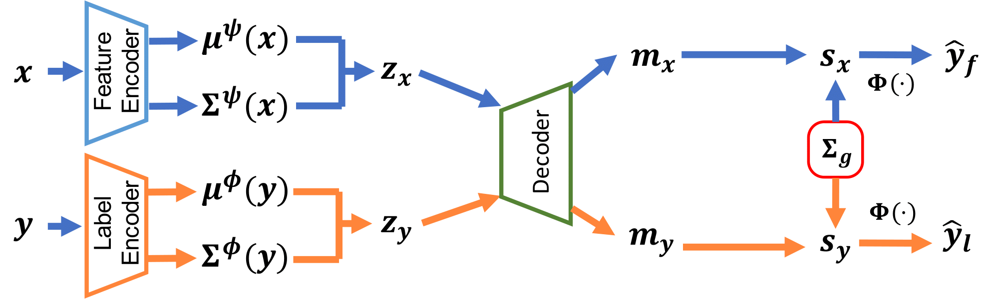

**MPVAE: Disentangled Variational Autoencoder based Multi-Label Classification with Covariance-Aware Multivariate Probit Model**</br>
Junwen Bai, Shufeng Kong, Carla Gomes</br>
IJCAI-PRICAI 2020<br/>
[[paper]](https://arxiv.org/abs/2007.06126)

## Overview
<div align=center></div>

In this paper, we propose Multi-variate Probit based Variational AutoEncoder (MPVAE) to 1) align the label embedding subspace and the feature embedding subspace and 2) handle the correlations between labels via classic Multi-variate Probit model. MPVAE improves both the **embedding space learning** and **label correlation encoding**. Furthermore, β-VAE brings disentanglement effects and could improve the performance compared to vanilla VAE.

## Requirements
- Python 3.7+
- TensorFlow 1.15.0
- numpy 1.17.3
- sklearn 0.22.1

Older versions might work as well.

A PyTorch implementation of MPVAE can be found [here](https://github.com/wenting-zhao/mpvae).

## Usage

### Download this Repository
```git clone``` this repo to your local machine.

### Obtain and Process the Data
All datasets can be downloaded from the Google [drive](https://drive.google.com/drive/folders/1dmok7TnvGrFUyS0RBbGt3PbcdHlVDB77?usp=sharing).

The downloaded datasets are already in the format that can be recognized by the code. 

### Data Format
The downloaded datasets are organized in the `npy` format. There are 4 `npy` files in total. One contains the data entries and the others are indices for train, validation and test splits. For example, mirflickr dataset has 4 `npy` files: `mirflickr_data.npy`, `mirflickr_train_idx.npy`, `mirflickr_val_idx.npy`, `mirflickr_test_idx.npy`.

<div align=center></div>
The data format is very simple and one can construct his/her own datasets. For each data point in `xxx_data.npy`, the first `meta_offset` (default 0) dims contains some meta information (e.g. index, description, etc.), which will not be considered as part of the features. The following `label_dim` entries indicate the 0/1 labels for this data point. The last `feat_dim` entries are the features used for training.

The other 3 `npy` files are just the lists of indices for different splits.

### Train and Test MPVAE

We use mirflickr as the running example here. The detailed descriptions of FLAGS can be found in `config.py`.

To train the model, use the following script:
```bash
./run_train_mirflickr.sh
```
The best validation checkpoint will be written into `run_test_mirflickr.sh` automatically, if one sets the flag `write_to_test_sh` to `True` and specifies the path to the test bash with flag `test_sh_path`.

To test the model, use the following script:
```bash
./run_test_mirflickr.sh
```
The default hyper-parameters should give reasonably good results.

If you have any questions, feel free to open an issue.

### Hyperparameters for More Datasets

One can further check the scripts under `scripts` folder, which contains tuned hyperparameters for most datasets. 

### Paper

If you find our paper interesting, or will use the datasets we collected, please cite our paper:

```bibtex
@inproceedings{bai2020disentangled,
  title={Disentangled Variational Autoencoder based Multi-Label Classification with Covariance-Aware Multivariate Probit Model},
  author={Bai, Junwen and Kong, Shufeng and Gomes, Carla},
  booktitle={Proceedings of the Twenty-Ninth International Joint Conference on Artificial Intelligence (IJCAI-20)},
  year={2020}
}
```

## References
[C2AE](https://github.com/hinanmu/C2AE_tensorflow)</br>
[LaMP](https://github.com/QData/LaMP)</br>
[DMVP](https://bitbucket.org/DiChen9412/icml2018_dmvp)</br>
[scikit-multilearn](http://scikit.ml/api/skmultilearn.html)
